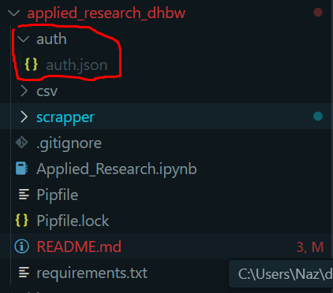
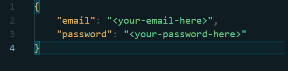

# Scrapper+Crawler for Applied Market Research 

## Installation 

```shell
# you should be in the applied_research_dhbw directory
pip install -r requirements.txt
```

## Usage

```shell
python ./scrapper/main.py -a or -m"[amazon or media markt.de url]" 
```

    -a - amazon url (customer reviews)
    -m - mediamarkt url 


## Amazon reviews

To lookup all reviews, you will need to input your amazon credentials. Another method instead is to make an "auth/auth.json" file, see image (see "Auth on the machine without the code editor" if you do not have one):
 


Should be in this format:



After that you will be able to scrape amazon reviews without any manual input after that.

Another thing is that Amazon might ask you to put in Captcha before entering your credentials. This is happening because you used too much of the same User-Agent. It'll require few steps to take, but will not prevent you from scraping.

 This will require you to look into the window that will open, up until authentication will proceed further. 

You will need to complete captcha by just entering six letters on the screen upper or lowercase. 

After you do that, you credentials you entered earlier will proceed to be put on and the program will run its course

It might take 2 turns of authentication so watch out for that.

## Auth on the machine without the code editor

- create text file
- write your credentials like so: 


- save it under the name of "auth.json" in the "auth" folder 
- structure of the project you can see above

 


## Description 

This is created as a proof of concept, kind of an alpha version of the actual bot that will be submitted with data as well during the submission date.

For now it is only accepting MediaMarkt.de URLs and does not work with any other platform. That is, however, going to change. 

## Warnings

- All credentials and private information not stored anywhere except this directory.
- If page of reviews in Amazon taking too long to load and reviews are not being scraped for more than 5 seconds, reload it using Ctrl+R
- Maximum amount of Amazon reviews is 200, due to constraints of the Amazon itself.


Hope you enjoy it,

Data Science Team